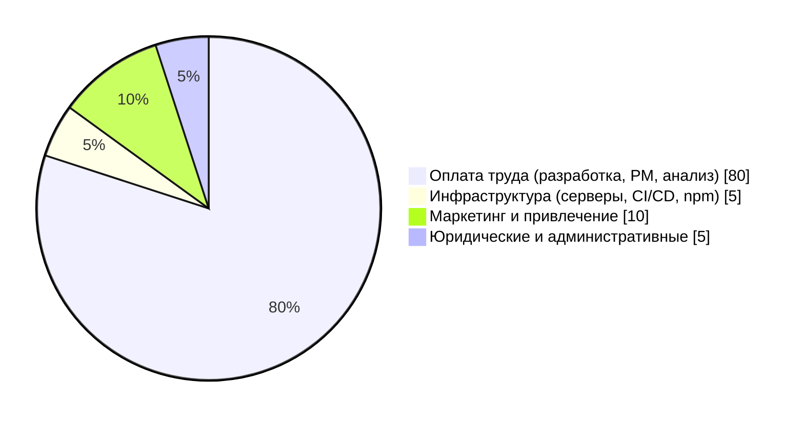

## Введение

**Актуальность** проекта обусловлена растущей потребностью ученых, студентов и технических писателей в инструментах, совмещающих простоту визуального редактирования (WYSIWYG) с мощью разметки LaTeX для сложных формул. Существующие решения либо излишне сложны, либо не поддерживают академическую специфику (таблицы, диаграммы, сноски). **Цель** работы — описание технологии инициации проекта «Scrider» как шаблона для запуска цифрового продукта. **Задачи** включают: анализ рынка, определение целей, приоритетов, команды, бизнес-модели, технологического стека и оценку привлекательности. **Практическая ценность** заключается в создании готового стартового документа, который может быть использован PM-ами для формализации проекта.

---

## Содержание

### 1. Резюме проекта и анализ рынка

Проект «Scrider» — это WYSIWYG-редактор для академических текстов с нативной поддержкой LaTeX-формул, сложных таблиц и диаграмм. Для обоснования уникальности выполнен сравнительный анализ конкурентов.

**Таблица 1.1 – Сравнительный анализ решений на рынке**

| Решение | Отличительные функции | Недостатки |
| :--- | :--- | :--- |
| **Quill** | Простой WYSIWYG, хорошая документированность, модульная архитектура | Нет поддержки LaTeX, таблицы реализованы слабо, не подходит для наукемов |
| **Editor.js** | Блочная структура, чистый JSON на выходе, кастомизируемые плагины | Нет встроенной поддержки формул и сложных таблиц, требует много доработок |
| **Draft.js** | Гибкость, управление состоянием через immutable, контроль над поведением | Крутая кривая обучения, нет готового UI, отсутствует поддержка диаграмм |
| **Scrider (наш)** | LaTeX-формулы «на лету», сложные таблицы с объединением ячеек, интеграция диаграмм (Mermaid), академический экспорт (LaTeX/PDF) | Нет сообщества (с нуля), начальный набор плагинов ограничен |

**Вывод:** Таким образом, ключевым отличием Scrider станет комбинация WYSIWYG и LaTeX-математики с поддержкой сложных таблиц и диаграмм, что закрывает нишу академических редакторов.

### 2. Определение цели проекта

Цель проекта отвечает на фундаментальные вопросы: зачем он создается, как повлияет на стейкхолдеров и команду. Мы создаем Scrider, потому что ученые и студенты теряют время на переключение между визуальным редактором и LaTeX-компилятором. Цель – создать инструмент, снижающий порог входа в научную верстку. Для заинтересованных сторон (студенты, ученые) это ускорит написание статей. Для инвесторов – выход на нишевой рынок EdTech. Для команды – создание инновационного продукта и рост экспертизы в области обработки формул.

**Вывод:** Таким образом, цель проекта сформулирована как «Разработка и вывод на рынок WYSIWYG-редактора Scrider, обеспечивающего 30% снижение времени на оформление академических текстов по сравнению с ручным набором LaTeX».

### 3. Определение приоритетов проекта

Приоритеты расставляются до детализации целей, чтобы избежать конфликтов в ходе разработки. Что важнее: скорость, качество, бюджет или функциональность?

**Таблица 1 – Инициирование проекта**

| Обоснование проекта | |
| :--- | :--- |
| **Назначение и обоснование** | Scrider предназначен для быстрого создания сложных академических документов. Требования: поддержка LaTeX-формул, сложных таблиц (rowspan/colspan), экспорт в LaTeX и PDF, работа в браузере. |
| **Цели и критерии успеха** | 1. Реализовать рабочий MVP за 4 месяца. 2. Достичь 1000 активных установок npm-пакета за 6 мес. 3. Удержать время ответа редактора < 100 мс при документе в 50 страниц. |

**Приоритеты (по схеме «сроки – содержание – бюджет – качество»):** Качество и стабильность ядра (LaTeX-рендеринг) важнее, чем «бюджет». Функция диаграмм – второго приоритета.

**Вывод:** Таким образом, главный приоритет – надежность отображения формул и таблиц, сроки – фиксированы, набор функций может быть сокращен при перегрузке.

### 4. Соотнесение целей со стратегическими бизнес-планами

Каждая цель проекта должна измеримо поддерживать бизнес-стратегию. Это превращает проект из «интересной идеи» в инвестиционный актив.

**Таблица 2 – Зависимость целей бизнес-стратегии и целей проекта**

| Цель бизнес-стратегии | Цель проекта |
| :--- | :--- |
| Увеличить долю в сегменте инструментов для науки (EdTech) на 5% к концу года | Выпустить редактор с уникальной поддержкой LaTeX-формул и таблиц, что повышает конверсию на 20% (измеряется через веб-демо) |
| Снизить затраты пользователей на верстку (цель — время на статью не более 2 часов) | Реализовать экспорт в LaTeX с сохранением форматирования, снизив ручной набор на 70% (проверяется A/B тестом) |
| Повысить техническую эффективность разработки через переиспользование компонентов | Разработать React-компонент, который можно встраивать в 3+ внешних платформ (LMS, блоги) |

**Вывод:** Таким образом, каждая цель проекта измерима (проценты, время, количество интеграций) и напрямую работает на бизнес-стратегию компании.

### 5. Описание команды проекта

Успех инициации зависит от наличия компетенций. В проекте «Scrider» задействованы следующие роли с указанием их релевантного опыта.

| Роль | Опыт на схожих проектах |
| :--- | :--- |
| **Руководитель проекта / DevOps** | Запуск 2 WYSIWYG-проектов, настройка CI/CD для npm-пакетов, опыт с GitHub Actions |
| **Fullstack-разработчик** | Разработка редактора на React + Node.js, реализация экспорта в LaTeX/PDF |
| **Frontend-разработчик** | Опыт кастомизации Slate.js и Draft.js, создание компонентов формул |
| **Бизнес-аналитик** | Анализ рынка EdTech, сбор требований от ученых из 3 университетов |
| **Технический писатель / Системный аналитик** | Спецификация API для плагинов, написание документации по интеграции |
| **UI-дизайнер** | Дизайн академических инструментов (опыт в Overleaf и Authorea подобных проектах) |

**Вывод:** Таким образом, команда сбалансирована и покрывает ключевые зоны (разработка ядра, аналитика, документация, дизайн), что снижает риски этапа инициации.

### 6. Бизнес-модель проекта (функциональная стратегия)

Функциональная стратегия Scrider ориентирована на создание ценности через технологическое превосходство и открытость.

**6.1 Ценностное предложение (Value Proposition)**
- Для пользователя: бесплатный базовый редактор + платные расширения (совместная работа, экспорт в Word, облачное хранение).
- Для бизнеса: продажа лицензий на встраивание редактора в корпоративные LMS и научные порталы.

**6.2 Целевые сегменты и каналы сбыта**
- Сегменты: студенты (B2C), STEM-университеты (B2B), научные издательства (B2B).
- Каналы: npm-реестр (для разработчиков), демо-сайт с тарифами, прямой маркетинг через научные конференции.

**6.3 Ключевые партнеры и ресурсы**
- Партнеры: GitHub (CI/CD), издательство «Наука», университеты (пилотные внедрения).
- Ресурсы: команда, открытая библиотека формул (собираемая сообществом).

**6.4 Структура затрат** (на 1-й год разработки и поддержки)

Основные затраты: оплата труда (80% — разработка, аналитика, дизайн), инфраструктура (5% — хостинг, CI/CD), маркетинг (10% — контекстная реклама, участие в конференциях), юридическое сопровождение (5% — лицензии, патентование). Диаграмма ниже иллюстрирует распределение.

**Вывод:** Таким образом, бизнес-модель базируется на функциональной стратегии «лучший академический редактор», где основные инвестиции идут в человеческий капитал.

### 7. Стек технологий

Технологический стек определяет скорость разработки, поддержки и интеграции. Scrider строится как переиспользуемый компонент.

| Категория | Технология | Обоснование |
| :--- | :--- | :--- |
| **Ядро UI** | React (TypeScript) | Стандарт индустрии, типизация для сложного состояния формул |
| **Редактор** | Надстройка над Slate.js | Гибкая модель данных, контроль над вводом LaTeX |
| **Формулы** | Katex (рендеринг) + свой парсер | Скорость рендеринга, поддержка большого набора LaTeX-команд |
| **Диаграммы** | Mermaid.js | Интеграция из коробки, текстовое описание |
| **CI/CD** | GitHub Actions, pnpm | Автоматизация тестов, сборки npm-пакета |
| **Контроль версий** | Git (GitHub) | Стандарт |

**Вывод:** Таким образом, выбранный стек (React + TypeScript + Slate + Katex + Mermaid) обеспечивает баланс между производительностью, типизацией и возможностью кастомизации под академические нужды.

### 8. Оценка привлекательности проекта по функционалу

Привлекательность проекта оценивается через ценность каждого функционального блока для целевой аудитории. Оценка проведена по шкале «низкая/средняя/высокая» востребованность и сложность.

| Функция | Востребованность | Сложность | Итоговая привлекательность | Планируется в MVP |
| :--- | :--- | :--- | :--- | :--- |
| WYSIWYG-ввод текста | Высокая | Средняя | 9/10 | Да |
| LaTeX-формулы в реальном времени | Критическая (ученые) | Высокая | 10/10 | Да |
| Сложные таблицы (объединение ячеек) | Высокая (авторы обзоров) | Высокая | 8/10 | Да |
| Диаграммы (Mermaid) | Средняя (технари) | Средняя | 7/10 | Нет (v2) |
| Экспорт в .tex и PDF | Высокая | Средняя | 9/10 | Да |
| Совместное редактирование | Средняя | Очень высокая | 5/10 | Нет (v3) |

**Вывод:** Таким образом, в рамках инициации проекта наиболее привлекательным и обязательным к реализации функционалом признаны: LaTeX-формулы, сложные таблицы и экспорт в LaTeX/PDF — именно они формируют уникальную ценность Scrider.

### 9. Подведение итога выполнения задания

В ходе работы подготовлен стартовый документ для инициации проекта «Scrider». Выполнены все 8 подпунктов: проведен сравнительный анализ рынка (выделены отличия от Quill, Editor.js, Draft.js), сформулирована измеримая цель, расставлены приоритеты (качество > сроки > функции), цели увязаны с бизнес-стратегией через таблицу с KPI. Определена команда из 6 человек с профильным опытом. Построена бизнес-модель на функциональной стратегии со структурой затрат (диаграмма в Mermaid). Описан стек (React, TS, Slate, Katex). Оценена привлекательность функционала, определен MVP. Документ готов к презентации стейкхолдерам.

**Вывод:** Таким образом, технология инициации проекта полностью применена к «Scrider», и проект может переходить к следующему этапу — планирования.

---

## Заключение

В результате проделанной работы составлен полный отчет по этапу инициации проекта, включающий резюме, цель, приоритеты, связь со стратегией, команду, бизнес-модель, технологии и оценку функционала. Показано, как формализовать обоснование проекта через сравнительный анализ конкурентов и измеримые критерии успеха. Определено, что «Scrider» имеет высокую привлекательность благодаря уникальной связке WYSIWYG + LaTeX, но требует фокуса на качестве ядра (формулы и таблицы) как главном приоритете. Итоговый отчет может служить шаблоном для PM-ов при запуске аналогичных цифровых продуктов.
