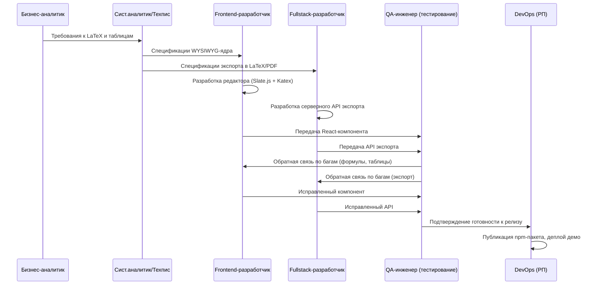
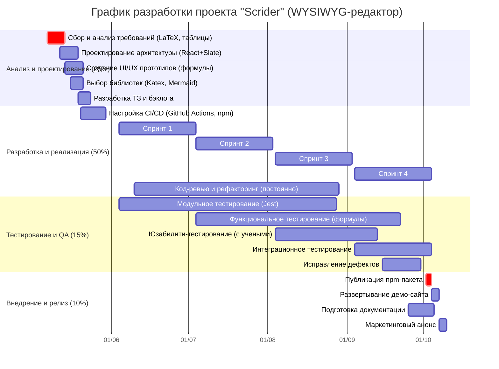

# Отчет по управлению проектом «Scrider»: Этап планирования. Часть 2. План разработки программного продукта

---

## 1. Процесс разработки программного обеспечения

Применяется **гибридная методология (Scrum + Waterfall)** , сочетающая предсказуемость Waterfall в планировании и архитектуре с гибкостью Scrum в реализации. Учитывается необходимость итеративной доработки сложных компонентов (LaTeX-формулы, таблицы) на основе обратной связи от ученых.

**Таблица 1.1 – Этапы разработки программного обеспечения**

| Этап | Сроки | Основные задачи | Результаты |
|------|-------|----------------|------------|
| **Инициирование и планирование** | 07.05–20.05.2025 (14 дней) | • Формализация требований к LaTeX и таблицам • Оценка рисков (сложность рендеринга формул) • Формирование команды (6 ролей с совмещением) • Утверждение плана и графика нагрузки | Устав проекта, WBS, план управления, бэклог |
| **Проектирование системы** | 21.05–03.06.2025 (14 дней) | • Проектирование архитектуры React-компонента • Создание UI/UX макетов (акцент на ввод формул) • Проектирование API для экспорта в LaTeX/PDF • Выбор библиотек (Slate.js, Katex, Mermaid) | Техническое задание, архитектурные диаграммы, прототипы экранов |
| **Реализация (4 спринта)** | 04.06–01.10.2025 (120 дней) | • **Спринт 1:** WYSIWYG-ядро на Slate.js • **Спринт 2:** LaTeX-формулы (Katex) • **Спринт 3:** Сложные таблицы (rowspan/colspan) • **Спринт 4:** Экспорт в .tex/.PDF + npm-пакет | Рабочий React-компонент, npm-пакет, документация кода |
| **Тестирование** | 02.06–24.09.2025 (параллельно реализации, 85 дней) | • Модульное тестирование (Jest) • Интеграционное тестирование формул • Юзабилити-тестирование с учеными • Нагрузочное тестирование (50 страниц, <100 мс) | Отчеты о тестировании, исправленные дефекты |
| **Внедрение и релиз** | 25.09–09.10.2025 (14 дней) | • Публикация npm-пакета • Развертывание демо-сайта • Подготовка документации по интеграции • Маркетинговый анонс | npm-пакет, демо-сайт, документация, гайдлайны |

---

## 2. Документация проекта

Комплекс документации охватывает все этапы жизненного цикла проекта и ориентирован как на внутреннюю команду, так и на внешних разработчиков, интегрирующих Scrider.

| Тип документации | Состав |
|------------------|--------|
| **Техническое задание** | Бизнес-требования (академические тексты), функциональные требования (LaTeX, таблицы, диаграммы), нефункциональные требования (производительность <100 мс), ограничения (React-экосистема), критерии приемки MVP |
| **Архитектурная документация** | Концептуальные диаграммы компонентов (React + Slate.js), диаграммы потока данных (формулы, таблицы), C4-диаграммы, диаграммы последовательностей для экспорта в LaTeX |
| **Пользовательские руководства** | Руководство по интеграции npm-пакета (для разработчиков), руководство пользователя (для ученых и студентов), примеры использования формул и таблиц |
| **API документация** | Спецификации методов экспорта (tex, pdf), примеры запросов/ответов, описание формата данных документа (JSON от Slate.js), коды ошибок |
| **Отчеты о тестировании** | Тест-планы (модульное, интеграционное, юзабилити), тест-кейсы для формул (100+ команд LaTeX), отчеты о дефектах, отчеты о приемочных испытаниях с участием фокус-группы |

**В итоге** документация обеспечивает прозрачность разработки, облегчает интеграцию редактора в сторонние проекты и создает базу для поддержки продукта.

---

## 3. Диаграмма последовательности разработки

Диаграмма отражает взаимодействие ролей в процессе разработки Scrider, с акцентом на итеративную передачу компонентов между разработчиками и тестировщиками.

---

## 4. Диаграмма Ганта (детализированная)

Визуализация графика разработки с разбивкой по этапам, спринтам и параллельным тестированием. Учтены критические зависимости между компонентами.

---

## 5. Контроль качества на каждом этапе

Многоуровневая система контроля качества, адаптированная под специфику академического редактора (формулы, таблицы, производительность).

| Этап | Методы контроля | Инструменты | Критерии качества |
|------|----------------|-------------|-------------------|
| **Планирование качества** | Определение метрик, создание чек-листов, установление критериев приемки | Confluence, Jira | Полнота требований, измеримость критериев |
| **Процессные проверки** | Код-ревью (2 аппрува), статический анализ, проверка соответствия стандартам TypeScript | GitHub, ESLint, Prettier | Отсутствие критических замечаний, прохождение линтеров |
| **Модульное тестирование** | Тестирование компонентов (формулы, таблицы, экспорт) | Jest, React Testing Library | Покрытие кода >80%, все тесты проходят |
| **Интеграционное тестирование** | Проверка взаимодействия Slate.js + Katex, корректность экспорта | Cypress, Postman | Формулы рендерятся без ошибок, таблицы сохраняют структуру |
| **Юзабилити-тестирование** | Тестирование с фокус-группой ученых (10+ человек) | UserTesting, Miro | 80% пользователей выполняют сценарии без подсказок |
| **Нагрузочное тестирование** | Документ 50 страниц, время ответа <100 мс | Lighthouse, Chrome DevTools | Выполнение нефункциональных требований |
| **Приемочное тестирование** | Проверка критериев приемки MVP (спонсорами и инвесторами) | Тест-кейсы, демо | Подписание акта приемки |

**В итоге** многоуровневая система контроля обеспечивает высокое качество продукта и минимизирует риски, связанные со сложностью LaTeX и таблиц.

---

## 6. Управление версиями и релизами

Внедрена система управления версиями на основе **GitFlow**, адаптированная для npm-пакета и React-компонента.

| Параметр | Значение |
|----------|----------|
| **Система контроля версий** | Git (GitHub) |
| **Модель ветвления** | GitFlow (main, develop, feature/*, release/*, hotfix/*) |
| **Стратегия тегирования** | Semantic Versioning (v1.0.0, v1.1.0, v2.0.0) |
| **Частота релизов** | Релиз после каждого спринта (каждые 30 дней), публикация в npm |
| **CI/CD пайплайн** | GitHub Actions: lint → test → build → publish to npm |

**Процесс выпуска релиза:**

1. Разработка новой функциональности в `feature/LaTeX-formulas` от `develop`
2. Код-ревью и слияние в `develop` после прохождения CI
3. Создание `release/v1.0.0` для стабилизации и финального тестирования
4. Исправление критических багов в release-ветке
5. Слияние в `main` с тегированием `v1.0.0`
6. Автоматическая публикация в npm через GitHub Actions
7. Слияние `main` обратно в `develop`

**Планируемые версии:**

| Версия | Содержание | Дата |
|--------|-----------|------|
| v0.1.0 | WYSIWYG-ядро (базовое форматирование) | 04.07.2025 |
| v0.2.0 | LaTeX-формулы (базовые 50 команд) | 04.08.2025 |
| v0.3.0 | Простые таблицы | 04.09.2025 |
| v1.0.0 | Сложные таблицы + экспорт в LaTeX/PDF | 02.10.2025 |
| v1.1.0 | Диаграммы (Mermaid) | 01.12.2025 |
| v2.0.0 | Совместное редактирование (планы) | 01.03.2026 |

**Таким образом,** процесс управления версиями обеспечивает стабильность, контроль изменений и предсказуемость для интеграторов.

---

## 7. Проблемы планирования и рекомендации

Выявлены ключевые проблемы, специфичные для проекта «Scrider», и разработаны рекомендации по их решению.

| Тип проблемы | Конкретная проблема | Рекомендации |
|--------------|--------------------|--------------|
| **Технические сложности** | Рендеринг LaTeX-формул в реальном времени (задержки, ошибки парсинга) | Использовать Katex с кэшированием, ограничить MVP 50 наиболее частотными командами, вынести сложные формулы в v2 |
| **Технические сложности** | Реализация rowspan/colspan в таблицах на Slate.js | Исследовать готовые плагины, выделить отдельный спринт, при невозможности — использовать кастомную модель данных |
| **Управленческие вызовы** | Изменение требований от ученых в процессе разработки (новые команды LaTeX) | Использовать гибкую методологию (Scrum), проводить демо каждые 2 недели, вести ранжированный бэклог |
| **Управленческие вызовы** | Совмещение ролей (РП + DevOps, техпис + системный аналитик) | Четко разделить зоны ответственности, вести документацию решений, использовать тайм-трекинг для выявления перегрузок |
| **Внешние факторы** | Изменение политики npm (платный публичный реестр) | Создать резервный план: собственный реестр (Verdaccio) или GitHub Packages |
| **Внешние факторы** | Появление нового конкурента с аналогичной функциональностью | Ускорить выход MVP, сфокусироваться на уникальной ценности (сложные таблицы + экспорт), патентовать ключевые алгоритмы |
| **Методологические проблемы** | Сочетание Waterfall (архитектура) и Agile (реализация) на одном проекте | Четко зафиксировать архитектурные решения на этапе проектирования, далее работать спринтами, не меняя ядро |

**Рекомендуемые буферы в плане:**

| Статья | Рекомендуемый буфер |
|--------|---------------------|
| Спринт 2 (LaTeX-формулы) | +5 дней на исследование редких команд |
| Спринт 3 (Сложные таблицы) | +5 дней на отладку rowspan/colspan |
| Тестирование | +7 дней на исправление критических багов |

**В итоге** проактивное планирование позволяет минимизировать влияние потенциальных проблем и сохранить контроль над сроками и бюджетом.

---

## 8. Заключение

Разработан детализированный **план разработки программного продукта проекта «Scrider»** — WYSIWYG-редактора для академических текстов с поддержкой LaTeX-формул, сложных таблиц и диаграмм.

**Основные результаты этапа планирования (часть 2):**

1. **Определен процесс разработки** (гибридный Scrum+Waterfall) с разбивкой на 5 этапов: инициирование, проектирование, реализация (4 спринта), тестирование (параллельно), внедрение.

2. **Сформирован комплекс документации** — от ТЗ до API-спецификаций и пользовательских руководств, ориентированный на внешних интеграторов.

3. **Построены диаграммы** — последовательности разработки и детализированная диаграмма Ганта с критическими путями.

4. **Разработана система контроля качества** — 7 уровней проверок от модульного тестирования до приемочных испытаний с участием ученых.

5. **Внедрено управление версиями** (GitFlow + Semantic Versioning) с планом публикации npm-пакета и CI/CD на GitHub Actions.

6. **Выявлены ключевые проблемы** (сложность LaTeX, таблицы, совмещение ролей) и предложены практические рекомендации с временными буферами.

**Таким образом,** план разработки обеспечивает стандартизацию процессов, предсказуемость результатов и готовность к переходу к фазе реализации проекта «Scrider». Результаты этапа планирования подлежат утверждению спонсором и руководителем проекта.