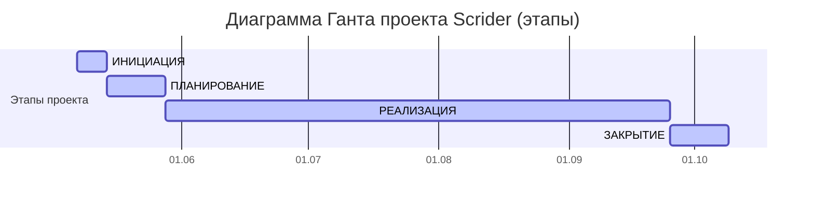
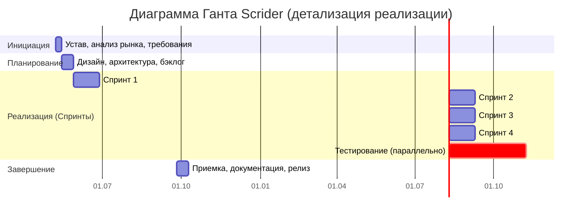

# Отчет по управлению проектом «Scrider»: Этап планирования. Часть 1. Общее планирование

---

## 1. Требования к проекту

| Требования | Опишите требования высокого уровня |
|------------|-----------------------------------|
| **Функциональные требования** | • WYSIWYG-редактирование текста с базовым форматированием • Поддержка LaTeX-формул в реальном времени (рендеринг через Katex) • Создание и редактирование сложных таблиц (rowspan/colspan) • Вставка и отображение диаграмм (Mermaid.js) — v2 • Экспорт документов в форматы .tex и .PDF • Режим просмотра и редактирования исходного LaTeX-кода |
| **Нефункциональные требования** | • Время ответа редактора < 100 мс при документе объемом 50 страниц • Поддержка современных браузеров (Chrome, Firefox, Safari, Edge) • Кросс-платформенность — React-компонент для встраивания в любые веб-приложения • Типизация кода (TypeScript) для удобства интеграции |
| **Предположения и ограничения проекта** | Срок реализации MVP — 4 месяца, полного релиза — 6 месяцев • Команда имеет опыт работы с React, TypeScript, Katex, Slate.js • npm-пакет будет распространяться под лицензией MIT • Отсутствие законодательных барьеров для использования LaTeX-библиотек |
| **Предварительное заявление о рисках** | • **Риск:** Сложность рендеринга LaTeX-формул в реальном времени   *Снижение:* Использование Katex, выделение спринта на исследование, MVP с базовыми формулами • **Риск:** Несоответствие UX ожиданиям ученых и студентов   *Снижение:* Раннее прототипирование, тестирование на фокус-группе из 10+ ученых • **Риск:** Задержки из-за сложности реализации сложных таблиц (rowspan/colspan)   *Снижение:* Приоритизация — сначала простые таблицы, сложные в v2 |
| **Сводный график вехи** | • Завершение сбора требований: +1 неделя • Полный дизайн ПО: +3 недели • Полное кодирование (MVP): +4 месяца • Тестирование и отладка: +5 месяцев • Внедрение (релиз v1.0): +6 месяцев |

---

## 2. Основные этапы проекта

Определены ключевые вехи, соответствующие жизненному циклу разработки программного обеспечения.

**Таблица 2.1 – Детализация проекта - дорожная карта (roadmap)**

| Веха | Описание |
|------|----------|
| Завершить сбор требований | Все функциональные и нефункциональные требования к редактору определены, согласованы с учеными и инвесторами. |
| Полный дизайн программного обеспечения | Создана дизайн-система редактора, прототипы экранов ввода формул и таблиц, утверждены UI/UX-решения. |
| Полное кодирование программного обеспечения | Завершена разработка React-компонента: WYSIWYG-ядро, поддержка LaTeX-формул, таблиц, экспорт. Создан npm-пакет. |
| Полное тестирование и отладка программного обеспечения | Проведено функциональное, юзабилити и нагрузочное тестирование. Все критичные ошибки исправлены. |
| Полный переход программного обеспечения | npm-пакет опубликован, документация передана, редактор готов к интеграции в сторонние проекты. |

---

## 3. Команда проекта и организационная структура

Сформирована проектная команда с распределением ролей и зон ответственности (с учетом совмещения ролей из лэндскейпа).

**Таблица 3.1 – Командная разработка проекта**

| Роль | Описание роли |
|------|---------------|
| Руководитель проекта / DevOps-инженер | Управление проектом, настройка CI/CD (GitHub Actions), координация команды, управление рисками |
| Бизнес-аналитик | Сбор и анализ требований от ученых и студентов, формирование vision, приоритизация функций |
| Технический писатель / Системный аналитик | Декомпозиция требований, проектирование логики формул и таблиц, создание спецификаций, документация |
| Fullstack-разработчик | Разработка серверной части (при необходимости), API, интеграции, админки, лендинга |
| Frontend-разработчик | Разработка React-компонента, WYSIWYG-ядра, интеграция LaTeX и таблиц |
| UI-дизайнер | Проектирование интерфейса редактора, создание прототипов формул и таблиц, гайдлайны |

---

## 4. Иерархическая структура работ (WBS)

Разработана детализированная структура работ, охватывающая все аспекты проекта.

### **1. ИНИЦИАЦИЯ (1 неделя)**
- Сделать описание и резюме проекта
- Разработка и согласование устава проекта
- Выявление ключевых стейкхолдеров (ученые, студенты, инвесторы)
- Определение бизнес-требований и целей MVP
- Первичная оценка рисков и ограничений
- Сравнительный анализ конкурентов (Quill, Editor.js, Draft.js)

### **2. ПЛАНИРОВАНИЕ (2 недели)**
- Создание Product Roadmap
- Разработка UI/UX дизайна и прототипов (акцент на ввод формул и таблиц)
- Планирование технической архитектуры (выбор Slate.js, Katex, Mermaid)
- Формирование бэклога разработки (приоритизация функций)
- Утверждение плана проекта и графика нагрузки команды

### **3. РЕАЛИЗАЦИЯ (4 месяца)**
- **Спринт 1 (1 месяц):** WYSIWYG-ядро на Slate.js, базовая панель инструментов
- **Спринт 2 (1 месяц):** Интеграция LaTeX-формул через Katex, рендеринг в реальном времени
- **Спринт 3 (1 месяц):** Реализация таблиц (сначала простые, затем сложные с rowspan/colspan)
- **Спринт 4 (1 месяц):** Экспорт в LaTeX и PDF, режим исходного кода, npm-паблишинг
- **Фаза тестирования:** Функциональное, юзабилити, нагрузочное тестирование

### **4. ЗАКРЫТИЕ (2 недели)**
- Проведение приемочного тестирования с участием фокус-группы ученых
- Публикация npm-пакета в реестре
- Финализация документации (руководство по интеграции, API-справка)
- Проведение ретроспективы проекта
- Оценка достижения целей проекта (1000 установок, 3+ интеграции)
- Формальное закрытие проекта и отчетность перед инвесторами

---

## 5. Ролевое участие в проектных этапах

**Таблица 5.1 – Лента участия в проекте** (аналог WebBlog с учетом совмещения ролей)

| Роль | Инициация | Планирование | Реализация | Завершение |
|------|-----------|-------------|------------|------------|
| **Руководитель проекта + DevOps** | 45% - Формирование устава, идентификация стейкхолдеров, оценка жизнеспособности, оценка инфраструктуры | 35% - Разработка плана проекта, распределение ресурсов, настройка CI/CD, проектирование инфраструктуры | 15% - Мониторинг прогресса, управление рисками, поддержка CI/CD | 5% - Финальная отчетность, закрытие проекта, документирование инфраструктуры |
| **Бизнес-аналитик** | 40% - Анализ рынка и конкурентов, формирование видения продукта, сбор требований от ученых | 40% - Детализация требований, создание PRD, приоритизация функций (LaTeX, таблицы) | 15% - Уточнение требований, приемочное тестирование | 5% - Участие в ретроспективе, передача знаний |
| **Технический писатель + Системный аналитик** | 20% - Предварительная оценка технической осуществимости (LaTeX, таблицы), оценка объема документации | 50% - Декомпозиция требований, проектирование логики формул, создание спецификаций, структуры документации | 25% - Уточнение ТЗ, поддержка разработчиков, создание руководств | 5% - Финализация документации, редактура |
| **Fullstack-разработчик** | 10% - Консультации по выбору технологий, оценка full-stack решений | 25% - Проектирование архитектуры API и вспомогательных систем (экспорт) | 60% - Разработка серверной логики, экспорта, лендинга, админки | 5% - Документирование кода, финальная доработка, багфиксы |
| **Frontend-разработчик** | 10% - Консультации по UI/UX возможностям (WYSIWYG, формулы), оценка frontend-решений | 30% - Проектирование компонентной архитектуры (Slate.js, Katex), выбор WYSIWYG-ядра | 55% - Разработка интерфейса, интеграция LaTeX-формул, таблиц | 5% - Рефакторинг, документация компонентов |
| **UI-дизайнер** | 20% - Исследование пользователей (студенты, ученые), конкурентный анализ (Quill, Overleaf, Authorea) | 50% - Создание дизайн-системы редактора, прототипов формул и таблиц, макетов | 25% - Поддержка разработки, адаптация дизайна под React-компоненты | 5% - Формирование гайдлайнов |

---

## 6. Диаграмма Ганта

Построен визуальный график выполнения работ, определяющий общий срок реализации проекта.

**Общий срок выполнения проекта:** с 07.05.2025 по 09.10.2025 (примерно 5 месяцев до завершения, полный цикл — 6 месяцев с учетом пост-релизной поддержки).

*В итоге диаграмма Ганта наглядно демонстрирует timeline проекта и взаимосвязи этапов.*

---

### Детализированная диаграмма Ганта (по спринтам реализации)

---

## 7. Итоги этапа планирования

Выполнены все пункты задания, аналогичные отчету WebBlog:

1. **Сформулированы требования** к проекту — функциональные (LaTeX-формулы, сложные таблицы, диаграммы, экспорт), нефункциональные (производительность <100 мс, браузерная совместимость), а также предположения, ограничения и риски с мерами их снижения.

2. **Определены ключевые вехи** (roadmap) — от сбора требований до полноценного перехода (релиза npm-пакета).

3. **Распределены роли в команде** с учетом совмещения (РП+DevOps, техпис+системный аналитик) и описаны их зоны ответственности.

4. **Построена иерархическая структура работ (WBS)** — детализация по 4 фазам (инициация, планирование, реализация с разбивкой на спринты, закрытие).

5. **Составлена лента участия** (таблица с процентами по фазам) — аналог WebBlog, адаптированный под специфику Scrider и сжатые сроки.

6. **Построена диаграмма Ганта** — как общая (этапы), так и детализированная по спринтам реализации, с указанием параллельного тестирования.

**Установлены реалистичные сроки выполнения работ:** инициация — 1 неделя, планирование — 2 недели, реализация — 4 месяца (4 спринта по 30 дней), закрытие — 2 недели. Общая длительность проекта — около 5–6 месяцев.

---

## Заключение по этапу планирования

Таким образом, создан **комплексный план управления проектом «Scrider»**, включающий требования, этапы, WBS, ролевое участие и визуализацию сроков. План учитывает ключевые риски (сложность LaTeX и таблиц) и предлагает их снижение через приоритизацию и спринтовую разработку.