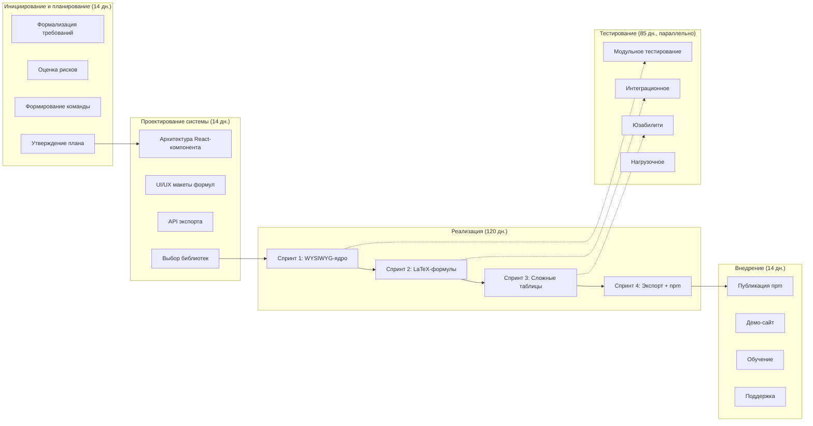
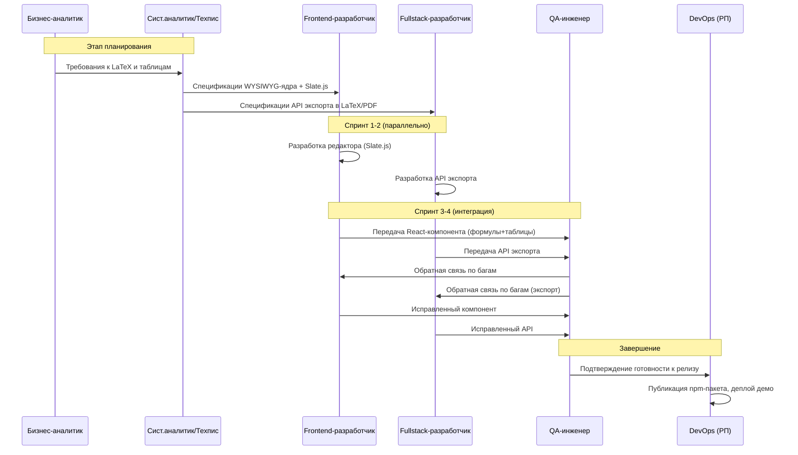

# **Отчет по управлению проектом «Scrider»: План разработки программного обеспечения**

---

## Введение

**Актуальность** разработки детализированного плана разработки ПО обусловлена необходимостью систематизации процессов создания WYSIWYG-редактора «Scrider», который совмещает визуальное редактирование с поддержкой LaTeX-формул и сложных таблиц. **Цель** данного документа — формализовать полный цикл разработки: от выбора методологии до управления релизами и контроля качества. **Задачи** включают описание процесса разработки, состава документации, диаграмм последовательности, системы контроля качества и версий, а также выявление потенциальных проблем. **Практическая ценность** заключается в создании рабочего плана, который обеспечивает предсказуемость, стандартизацию и снижение рисков при разработке продукта.

---

## Содержание

### 1. Описание программного проекта

Проект «Scrider» представляет собой WYSIWYG-редактор для академических текстов, реализованный как React-компонент с поддержкой LaTeX-формул (через Katex), сложных таблиц (rowspan/colspan), диаграмм (Mermaid) и экспорта в LaTeX/PDF. Основные бизнес-потребности включают импортозамещение зарубежных решений (Overleaf, Authorea) и снижение времени на оформление научных статей на 30%. Спецификация требований к ПО (SRS) охватывает функциональные (ввод формул, таблицы, экспорт) и нефункциональные требования (время ответа <100 мс). Требования к пользовательскому интерфейсу включают интуитивную панель инструментов, режим редактирования формул «как в LaTeX» и адаптацию под академические стандарты.

**В итоге**, четко определенный профиль проекта позволяет синхронизировать ожидания стейкхолдеров и команды разработки.

---

### 2. Процесс разработки программного обеспечения

Применяется **гибридная методология (Scrum + Waterfall)**. На этапах инициирования, проектирования и внедрения используется предсказуемость Waterfall (фиксация архитектуры и требований), а на этапе реализации — гибкость Scrum с 4 спринтами по 30 дней. Это позволяет сочетать стабильность верхнеуровневого планирования с адаптивностью к уточнениям LaTeX-рендеринга и таблиц.

**Таблица 1.1 – Этапы разработки программного обеспечения**

| Этап | Сроки | Основные задачи | Результаты |
|------|-------|----------------|------------|
| **Инициирование и планирование** | 07.05–20.05.2025 (14 дн.) | 1. Формализация требований к LaTeX и таблицам 2. Оценка рисков (сложность рендеринга формул) 3. Формирование команды (6 ролей с совмещением) 4. Утверждение плана и WBS | Устав проекта, WBS, бэклог, график нагрузки |
| **Проектирование системы** | 21.05–03.06.2025 (14 дн.) | 1. Проектирование архитектуры React-компонента 2. Создание UI/UX макетов (акцент на ввод формул) 3. Проектирование API для экспорта в LaTeX/PDF 4. Выбор библиотек (Slate.js, Katex, Mermaid) | ТЗ, архитектурные диаграммы, прототипы |
| **Реализация** | 04.06–01.10.2025 (120 дн.) | 1. Спринт 1: WYSIWYG-ядро на Slate.js 2. Спринт 2: LaTeX-формулы (Katex) 3. Спринт 3: Сложные таблицы (rowspan/colspan) 4. Спринт 4: Экспорт + npm-пакет | Рабочий React-компонент, npm-пакет |
| **Тестирование** | 02.06–24.09.2025 (параллельно, 85 дн.) | 1. Модульное тестирование (Jest) 2. Интеграционное тестирование формул 3. Юзабилити-тестирование с учеными 4. Нагрузочное тестирование | Отчеты о тестировании, исправленные дефекты |
| **Внедрение** | 25.09–09.10.2025 (14 дн.) | 1. Публикация npm-пакета 2. Развертывание демо-сайта 3. Обучение пользователей (документация) 4. Техническая поддержка | npm-пакет, демо-сайт, документация |

**Схема этапов разработки в Mermaid:**

**В итоге**, гибридная методология обеспечивает предсказуемость архитектуры и гибкость в реализации сложных компонентов (формулы, таблицы).

---

### 3. Документация проекта

Комплекс документации охватывает все этапы жизненного цикла проекта и ориентирован как на внутреннюю команду, так и на внешних разработчиков, интегрирующих Scrider.

| Тип документации | Состав | Назначение |
|------------------|--------|------------|
| **Техническое задание (ТЗ)** | Бизнес-требования (академические тексты), функциональные требования (LaTeX, таблицы, диаграммы), нефункциональные требования (производительность <100 мс), ограничения (React-экосистема), критерии приемки MVP | Единый источник требований для команды и заказчика |
| **Архитектурная документация** | Концептуальные диаграммы компонентов (React + Slate.js), логические диаграммы потока данных (формулы, таблицы), диаграммы прецедентов (действия пользователя), диаграммы последовательностей (экспорт в LaTeX), C4-диаграммы (контекст, контейнеры, компоненты, код) | Фиксация архитектурных решений и коммуникация между разработчиками |
| **Пользовательские руководства** | Руководство по интеграции npm-пакета (для разработчиков), руководство пользователя (для ученых и студентов), примеры использования формул и таблиц, FAQ по академической верстке | Обеспечение успешного внедрения и снижение поддержки |
| **API документация** | Спецификации методов экспорта (tex, pdf), примеры запросов/ответов, описание формата данных документа (JSON от Slate.js), коды ошибок, описание хуков и пропсов React-компонента | Облегчение интеграции сторонними разработчиками |
| **Отчеты о тестировании** | Тест-планы (модульное, интеграционное, юзабилити), тест-кейсы для формул (100+ команд LaTeX), отчеты о дефектах с приоритетами, отчеты о приемочных испытаниях с участием фокус-группы | Доказательство качества продукта и основа для приемки |

**В итоге**, полноценная документация обеспечивает прозрачность разработки, снижает риски потери знаний и облегчает поддержку продукта после релиза.

---

### 4. Диаграмма последовательности разработки

Диаграмма отражает взаимодействие ролей в процессе разработки Scrider, с акцентом на итеративную передачу компонентов между аналитиками, разработчиками и тестировщиками, а также на параллельную работу фронтенда и фулстека.

**В итоге**, диаграмма наглядно демонстрирует параллельную работу фронтенда и бэкенда, итеративный характер тестирования и финальную координацию DevOps.

---

### 5. Контроль качества на каждом этапе

Контроль качества (QC) интегрирован в каждый этап разработки. Цель — обеспечить соответствие продукта требованиям к LaTeX-формулам, сложным таблицам и производительности. Объем включает все компоненты: WYSIWYG-ядро, парсер формул, табличный движок, экспорт. Политика — «качество на каждом шаге», а не только перед релизом. Обязанности распределены: QA-инженер отвечает за тестирование, разработчики — за юнит-тесты и код-ревью, PM — за метрики качества.

**План тестирования:**

1. **Планирование качества**
   - Определение метрик (покрытие кода >80%, время ответа <100 мс)
   - Создание чек-листов проверки формул (100+ команд LaTeX)
   - Установление критериев приемки для каждого спринта
   - Назначение ответственных за каждый вид тестирования

2. **Процессные проверки (на каждом коммите)**
   - Код-ревью с обязательным участием двух разработчиков
   - Статический анализ кода (ESLint, TypeScript strict mode)
   - Проверка соответствия стандартам (Prettier, Convention Commits)
   - Анализ зависимости (pnpm audit, безопасность)

3. **Модульное тестирование (в процессе реализации)**
   - Тестирование функций парсинга LaTeX (Jest)
   - Тестирование компонентов таблиц (React Testing Library)
   - Тестирование утилит экспорта (изолированные тесты)
   - Автоматизация в CI (GitHub Actions, каждый push)

4. **Интеграционное тестирование (на стыке спринтов)**
   - Проверка взаимодействия Slate.js + Katex
   - Корректность экспорта LaTeX/PDF end-to-end
   - Совместная работа фронтенда и API экспорта
   - Тестирование граничных случаев (пустая формула, вложенные таблицы)

5. **Юзабилити-тестирование (после Спринта 2 и 3)**
   - Тестирование с фокус-группой ученых (10+ человек)
   - Сценарии: написание статьи с формулами, создание таблицы
   - Сбор метрик времени выполнения задач
   - Оценка по шкале SUS (System Usability Scale)

6. **Нагрузочное тестирование (перед релизом)**
   - Тестирование с документом 50 страниц (500+ формул)
   - Измерение времени ответа редактора (<100 мс)
   - Тестирование памяти (отсутствие утечек при длительной работе)
   - Производительность экспорта (PDF до 30 секунд)

7. **Приемочное тестирование (UAT)**
   - Проверка критериев приемки MVP (совместно со спонсором)
   - Демонстрация работы формул и таблиц
   - Подписание акта приемки версии
   - Передача в эксплуатацию

**В итоге**, многоуровневая система контроля качества гарантирует, что каждая функция (особенно LaTeX и таблицы) проходит проверку на всех уровнях: от модуля до пользовательского опыта.

---

### 6. Управление версиями и релизами

Внедрена система управления версиями на основе **GitFlow**, адаптированная для npm-пакета и React-компонента. Это обеспечивает контроль изменений, параллельную разработку функций и стабильность релизов.

| Параметр | Значение | Обоснование |
|----------|----------|-------------|
| **Система контроля версий** | Git (GitHub) | Стандарт индустрии, интеграция с CI/CD |
| **Модель ветвления** | GitFlow (main, develop, feature/*, release/*, hotfix/*) | Разделение стабильного кода и разработки, поддержка hotfix |
| **Стратегия тегирования** | Semantic Versioning (v1.0.0, v1.1.0, v2.0.0) | Понятные пользователям версии, совместимость |
| **Частота релизов** | Каждые 2 недели (после каждого спринта) | Agile-циклы, быстрая доставка ценности |
| **CI/CD пайплайн** | GitHub Actions (lint → test → build → publish to npm) | Автоматизация качества и доставки |

**Процесс выпуска релиза (поэтапно):**

1. **Разработка функции** — создание `feature/LaTeX-formulas` от `develop`, ежедневные коммиты.
2. **Код-ревью и тестирование** — после завершения, пулл-реквест, прохождение CI (линтеры, тесты).
3. **Слияние в develop** — после двух аппрувов и зелёного CI.
4. **Создание release-ветки** — `release/v1.0.0` для стабилизации (только исправления багов, новые функции не добавляются).
5. **Финальное тестирование** — интеграционное и нагрузочное тестирование в release-ветке.
6. **Слияние в main** — после успешного тестирования, с тегированием `v1.0.0`.
7. **Автоматическая публикация в npm** — GitHub Actions при создании тега публикует пакет.
8. **Слияние main обратно в develop** — синхронизация hotfix-исправлений.

**Планируемые версии и релизы:**

| Версия | Содержание | Планируемая дата | Тип релиза |
|--------|-----------|------------------|------------|
| v0.1.0 | WYSIWYG-ядро (базовое форматирование) | 04.07.2025 | Внутренний |
| v0.2.0 | LaTeX-формулы (базовые 50 команд) | 04.08.2025 | Альфа |
| v0.3.0 | Простые таблицы | 04.09.2025 | Бета |
| v1.0.0 | Сложные таблицы + экспорт в LaTeX/PDF | 02.10.2025 | Стабильный (MVP) |
| v1.1.0 | Диаграммы (Mermaid) | 01.12.2025 | Функциональный |
| v2.0.0 | Совместное редактирование (планы) | 01.03.2026 | Мажорный |

**В итоге**, GitFlow с двухнедельными релизами обеспечивает стабильность, контроль версий и предсказуемость для интеграторов.

---

### 7. Проблемы, возникающие при планировании, и рекомендации

При планировании разработки Scrider выявлены ключевые проблемы, характерные для сложных WYSIWYG-редакторов с поддержкой LaTeX. Ниже приведены их категории, конкретные проявления и рекомендации по решению.

**Технические сложности:**
- **Проблема 1:** Рендеринг LaTeX-формул в реальном времени вызывает задержки при быстром вводе.
- **Проблема 2:** Реализация rowspan/colspan в таблицах на Slate.js нетривиальна (отсутствие готовых решений).
- **Проблема 3:** Экспорт в PDF с формулами требует рендеринга SVG через MathJax (тяжеловесный, 800KB).

**Рекомендации:**
1. Использовать Katex с кэшированием (рендерить только видимые формулы).
2. Выделить отдельный спринт на исследование таблиц, при невозможности — кастомная модель данных.
3. Lazy-load MathJax только при вызове экспорта PDF (dynamic import), кэшировать SVG формулы.

**Управленческие вызовы:**
- **Проблема 1:** Изменение требований от ученых в процессе разработки (новые команды LaTeX).
- **Проблема 2:** Совмещение ролей (РП + DevOps, техпис + системный аналитик) ведет к перегрузке.
- **Проблема 3:** Координация параллельных спринтов (фронтенд vs фулстек).

**Рекомендации:**
1. Использовать гибкую методологию (Scrum), проводить демо каждые 2 недели, ранжированный бэклог.
2. Четко разделить зоны ответственности, вести тайм-трекинг, предусмотреть бэк-ап роли.
3. Ежедневные 15-минутные синхронизации, общая доска задач (Jira), API-контракты в начале спринта.

**Внешние факторы:**
- **Проблема 1:** Изменение политики npm (платный публичный реестр) — риск для публикации.
- **Проблема 2:** Появление нового конкурента с аналогичной функциональностью.
- **Проблема 3:** Блокировка CDN (unpkg, jsdelivr) для загрузки библиотек.

**Рекомендации:**
1. Создать резервный план: собственный реестр (Verdaccio) или GitHub Packages.
2. Ускорить выход MVP, сфокусироваться на уникальной ценности (сложные таблицы + экспорт), патентовать ключевые алгоритмы.
3. Хостить все библиотеки локально или использовать зеркала, отказаться от внешних CDN.

**Методологические проблемы:**
- **Проблема 1:** Сочетание Waterfall (архитектура) и Agile (реализация) на одном проекте — риски разрыва.
- **Проблема 2:** Неопределенность критериев «готовности» для спринтов (Definition of Done).
- **Проблема 3:** Документирование в условиях быстрых итераций.

**Рекомендации:**
1. Четко зафиксировать архитектурные решения (C4-диаграммы) до начала спринтов, далее не менять ядро.
2. Утвердить единый DoD: код-ревью, тесты (покрытие >80%), документация (JSDoc), пройден CI.
3. Выделить 10% времени спринта на документацию, использовать автогенерацию (TypeDoc).

**Рекомендуемые буферы в плане:**
| Статья | Рекомендуемый буфер | Обоснование |
|--------|---------------------|-------------|
| Спринт 2 (LaTeX-формулы) | +5 дней | Исследование редких команд, отладка парсера |
| Спринт 3 (Сложные таблицы) | +5 дней | Отладка rowspan/colspan, edge cases |
| Тестирование | +7 дней | Исправление критических багов перед релизом |

**В итоге**, проактивное выявление проблем и внедрение буферов позволяет минимизировать риски и сохранить контроль над сроками.

---

## Заключение

В результате проделанной работы разработан **детализированный план разработки программного продукта** для проекта «Scrider» — WYSIWYG-редактора для академических текстов с поддержкой LaTeX-формул и сложных таблиц. Определены этапы жизненного цикла (инициирование, проектирование, реализация, тестирование, внедрение) с указанием сроков, задач и результатов для каждого. Описан полный комплект документации (ТЗ, архитектурная документация, руководства, API, отчеты о тестировании), построены диаграммы последовательности и контроля качества. Внедрена система управления версиями на основе GitFlow с двухнедельными релизами и Semantic Versioning. Выявлены ключевые проблемы (технические, управленческие, внешние, методологические) и предложены практические рекомендации с временными буферами. План обеспечивает стандартизацию процессов, предсказуемость результатов и готовность к переходу к фазе реализации проекта.