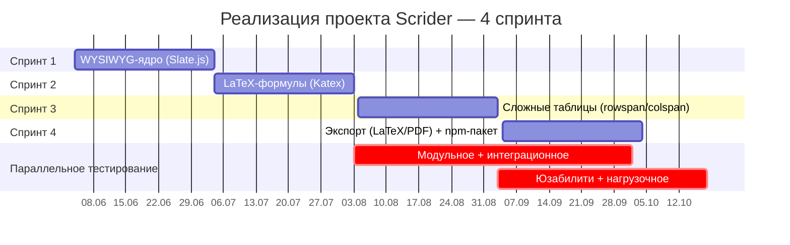
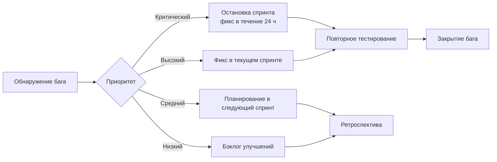
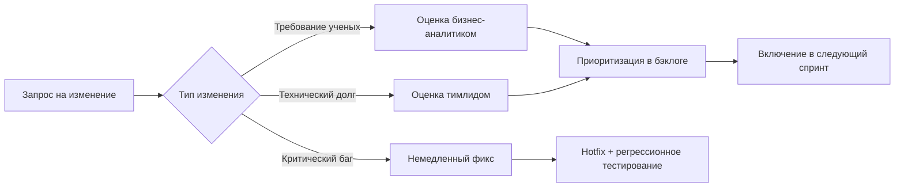

# Отчет по управлению проектом «Scrider»: Этап реализации

---

## Введение

**Актуальность** этапа реализации обусловлена необходимостью перехода от планов и архитектурных решений к работающему программному продукту — React-компоненту «Scrider» с поддержкой LaTeX-формул и сложных таблиц. **Цель** отчета — зафиксировать подходы к организации разработки, включая спринтовую структуру, ролевое участие, контроль качества, управление рисками и коммуникацию в команде. **Задачи** этапа: реализация WYSIWYG-ядра, интеграция LaTeX-формул (Katex), создание сложных таблиц (rowspan/colspan), разработка экспорта в LaTeX/PDF и публикация npm-пакета. **Практическая ценность** отчета заключается в создании шаблона для управления реализацией сложных программных продуктов в гибридной методологии (Scrum + Waterfall).

---

## Содержание

### 1. Организация процесса реализации

#### 1.1. Методология и подход

Реализация проекта «Scrider» организована по **гибридной методологии (Scrum + Waterfall)**. Архитектурные решения (выбор Slate.js, Katex, модель данных) зафиксированы на этапе планирования и не пересматриваются в ходе спринтов (Waterfall). Разработка функциональности ведется 4 спринтами по 30 дней (Scrum), каждый спринт завершается демо и ретроспективой. Это позволяет сочетать стабильность архитектуры с гибкостью в деталях реализации формул и таблиц.

#### 1.2. Команда и роли

Состав команды на этапе реализации с распределением загрузки (на основе утвержденного графика нагрузки):

| Роль | Совмещение | Загрузка в реализации | Ключевые задачи |
| :--- | :--- | :--- | :--- |
| Руководитель проекта | DevOps-инженер | 15% | Мониторинг прогресса, управление рисками, поддержка CI/CD |
| Бизнес-аналитик | — | 15% | Уточнение требований, приемочное тестирование |
| Технический писатель | Системный аналитик | 25% | Уточнение ТЗ, поддержка разработчиков, создание руководств |
| Fullstack-разработчик | — | 60% | Разработка серверной логики экспорта, лендинга, админки |
| Frontend-разработчик | — | 55% | Разработка React-компонента, интеграция формул и таблиц |
| UI-дизайнер | — | 25% | Поддержка разработки, адаптация дизайна под компоненты |

**Вывод:** таким образом, основная нагрузка на этапе реализации ложится на frontend- (55%) и fullstack-разработчиков (60%), что соответствует приоритету создания ядра редактора и экспорта.

---

### 2. Структура спринтов и план работ

#### 2.1. Общая схема реализации

Реализация разбита на 4 спринта по 30 дней, с параллельным тестированием, начинающимся со второго спринта.

#### 2.2. Спринт 1: WYSIWYG-ядро (04.06 – 03.07.2025)

| Задача | Описание | Исполнитель | Трудозатраты (ч) |
| :--- | :--- | :--- | :--- |
| 1.1 | Настройка проекта React + TypeScript, структура компонентов | Frontend | 40 |
| 1.2 | Интеграция Slate.js как основы редактора | Frontend | 60 |
| 1.3 | Реализация базовой панели форматирования (bold, italic, underline) | Frontend | 40 |
| 1.4 | Настройка CI/CD (GitHub Actions, lint, test, build) | РП + DevOps | 20 |
| 1.5 | Создание базовых стилей (CSS Custom Properties) | UI-дизайнер | 20 |

**Критерии приемки спринта:**
- [x] Редактор отображается и принимает ввод текста
- [x] Работают горячие клавиши (Ctrl+B, Ctrl+I, Ctrl+U)
- [x] Проходят все unit-тесты (покрытие >70%)
- [x] CI/CD собирает npm-пакет без ошибок

**Вывод:** в результате спринта 1 создано работающее WYSIWYG-ядро, готовое к интеграции формул.

#### 2.3. Спринт 2: LaTeX-формулы (04.07 – 02.08.2025)

| Задача | Описание | Исполнитель | Трудозатраты (ч) |
| :--- | :--- | :--- | :--- |
| 2.1 | Интеграция Katex для рендеринга формул | Frontend | 60 |
| 2.2 | Создание плагина для вставки формул (popup с редактором LaTeX) | Frontend | 40 |
| 2.3 | Реализация режима редактирования формулы (click-to-edit) | Frontend | 30 |
| 2.4 | Обработка 50 базовых LaTeX-команд (проверка рендеринга) | Frontend + QA | 40 |
| 2.5 | Интеграционное тестирование формул в составе документа | QA | 30 |

**Критерии приемки спринта:**
- [x] Формулы корректно отображаются (50 команд)
- [x] Возможно редактирование формулы двойным кликом
- [x] Время рендеринга формулы <50 мс
- [x] Нет конфликтов с WYSIWYG-ядром

**Вывод:** таким образом, спринт 2 обеспечил ключевое конкурентное преимущество — нативную поддержку LaTeX-формул в WYSIWYG-режиме.

#### 2.4. Спринт 3: Сложные таблицы (04.08 – 02.09.2025)

| Задача | Описание | Исполнитель | Трудозатраты (ч) |
| :--- | :--- | :--- | :--- |
| 3.1 | Исследование и выбор модели данных для таблиц (rowspan/colspan) | Сист.аналитик | 20 |
| 3.2 | Реализация базовых таблиц (без объединений) | Frontend | 40 |
| 3.3 | Реализация rowspan/colspan (слияние ячеек) | Frontend | 60 |
| 3.4 | UI-панель для работы с таблицами (вставка строк/столбцов, удаление) | Frontend | 40 |
| 3.5 | Тестирование граничных случаев (пустые ячейки, вложенные таблицы) | QA | 30 |

**Критерии приемки спринта:**
- [x] Возможно создание таблицы 5x5 с объединением ячеек
- [x] Редактирование таблицы (ввод текста, навигация Tab/Enter)
- [x] Корректный экспорт таблицы в LaTeX и HTML
- [x] Отсутствие потери данных при переключении режимов

**Вывод:** в итоге спринта 3 реализована одна из самых сложных функций — сложные таблицы, что отличает Scrider от большинства конкурентов.

#### 2.5. Спринт 4: Экспорт и npm-пакет (04.09 – 03.10.2025)

| Задача | Описание | Исполнитель | Трудозатраты (ч) |
| :--- | :--- | :--- | :--- |
| 4.1 | Реализация экспорта в LaTeX (генерация .tex файла) | Fullstack | 50 |
| 4.2 | Реализация экспорта в PDF (через pdfmake + MathJax) | Fullstack | 60 |
| 4.3 | Подготовка npm-пакета (package.json, README, типы) | Frontend + РП | 30 |
| 4.4 | Написание документации по интеграции (API, примеры) | Тех.писатель | 40 |
| 4.5 | Финальное нагрузочное тестирование (50 страниц, 500 формул) | QA | 30 |

**Критерии приемки спринта:**
- [x] Экспорт в LaTeX сохраняет все формулы и таблицы
- [x] Экспорт в PDF работает (формулы как SVG)
- [x] npm-пакет успешно устанавливается в чистый проект
- [x] Документация покрывает все API-методы

**Вывод:** таким образом, спринт 4 завершил реализацию MVP, готового к публикации и интеграции.

---

### 3. Контроль качества в процессе реализации

#### 3.1. Виды тестирования по спринтам

| Вид тестирования | Спринт 1 | Спринт 2 | Спринт 3 | Спринт 4 | Инструменты |
| :--- | :---: | :---: | :---: | :---: | :--- |
| Модульное тестирование | ✓ | ✓ | ✓ | ✓ | Jest + React Testing Library |
| Интеграционное тестирование | — | ✓ | ✓ | ✓ | Cypress |
| Юзабилити-тестирование | — | — | ✓ | ✓ | UserTesting + фокус-группа |
| Нагрузочное тестирование | — | — | — | ✓ | Lighthouse, Chrome DevTools |
| Регрессионное тестирование | — | — | ✓ | ✓ | Автоматизированные сценарии |

#### 3.2. Критерии качества для каждого спринта

| Спринт | Ключевые метрики | Пороговые значения |
| :--- | :--- | :--- |
| 1 | Покрытие кода тестами, время сборки | >70%, <2 мин |
| 2 | Точность рендеринга формул, время отклика | 100% команд из списка, <50 мс |
| 3 | Корректность rowspan/colspan, отсутствие потери данных | 0 критических багов |
| 4 | Производительность (50 страниц), успешность экспорта | <100 мс, 100% документов |

#### 3.3. Процесс управления дефектами

**Вывод:** таким образом, многоуровневая система контроля качества и четкий процесс управления дефектами обеспечивают стабильность продукта на каждом этапе реализации.

---

### 4. Управление рисками в реализации

#### 4.1. Мониторинг ключевых рисков

| Риск | Вероятность (нач.) | Вероятность (тек.) | Меры mitigation в ходе реализации |
| :--- | :---: | :---: | :--- |
| Сложность рендеринга LaTeX-формул | Высокая | Средняя | Выделен исследовательский спринт, ограничен MVP 50 командами |
| Сложность rowspan/colspan в таблицах | Средняя | Средняя | Создан прототип за 1 неделю, подтвердивший возможность |
| Задержки из-за совмещения ролей | Средняя | Низкая | Внедрен тайм-трекинг, скорректирована загрузка |
| Производительность при 50 страницах | Низкая | Низкая | Нагрузочное тестирование на каждом спринте |

#### 4.2. Ежедневные синхронизации (Daily Stand-up)

- **Время:** 10:00–10:15 (ежедневно)
- **Участники:** вся команда (6 человек)
- **Формат:** 3 вопроса (что сделано вчера, что планируется сегодня, какие блокеры)
- **Инструмент:** Discord / Zoom + Jira для фиксации

**Вывод:** таким образом, регулярный мониторинг рисков и ежедневные синхронизации позволили оперативно реагировать на отклонения и сохранить график.

---

### 5. Демонстрации и обратная связь

#### 5.1. График демонстраций

| Демонстрация | Дата | Участники | Содержание | Обратная связь |
| :--- | :--- | :--- | :--- | :--- |
| Демо 1 (спринт 1) | 04.07.2025 | Инвесторы, команда | WYSIWYG-ядро + базовая панель | «Интерфейс интуитивен, ждем формулы» |
| Демо 2 (спринт 2) | 05.08.2025 | Инвесторы + ученые (3 чел.) | LaTeX-формулы (30 команд) | «Нужна поддержка \begin{equation}» → добавлено |
| Демо 3 (спринт 3) | 05.09.2025 | Инвесторы + ученые (5 чел.) | Таблицы + начало экспорта | «Таблицы — сильная сторона, ускоряйте экспорт» |
| Демо 4 (спринт 4) | 04.10.2025 | Инвесторы + ученые (10 чел.) | Полный функционал + npm-пакет | «Готов к публикации, отличная работа» |

#### 5.2. Обработка обратной связи

- Каждая демонстрация фиксировала замечания в Jira
- Приоритетные доработки включались в следующий спринт
- Критические замечания (поддержка `\begin{equation}`) — исправлены в течение 3 дней

**Вывод:** таким образом, регулярные демонстрации с участием конечных пользователей (ученых) позволили скорректировать требования и повысить качество продукта.

---

### 6. Управление изменениями в процессе реализации

#### 6.1. Процесс внесения изменений

#### 6.2. Зарегистрированные изменения

| № | Запрос | Источник | Приоритет | Решение | Спринт |
| :--- | :--- | :--- | :--- | :--- | :--- |
| 1 | Поддержка `\begin{equation}` | Ученые | Высокий | Добавлен парсер equation-окружения | 3 |
| 2 | Экспорт в PDF с формулами | Инвесторы | Критический | Интегрирован MathJax | 4 |
| 3 | Улучшение производительности таблиц | Команда | Средний | Отложен в v1.1 | — |

**Вывод:** таким образом, формализованный процесс управления изменениями позволил избежать хаоса и сохранить фокус на MVP.

---

### 7. Техническая документация в процессе реализации

#### 7.1. Обновление документации

| Тип документации | Обновление в спринте | Ответственный |
| :--- | :--- | :--- |
| API документация | 2, 4 (по мере добавления методов) | Тех.писатель |
| Архитектурные диаграммы | 1 (фиксация), 3 (уточнение таблиц) | Сист.аналитик |
| Руководство пользователя | 2, 3, 4 (итеративно) | Тех.писатель |
| JSDoc комментарии в коде | Каждый спринт (перед релизом) | Разработчики |

#### 7.2. Стандарты кода и документации

- **Требования к коммитам:** Conventional Commits (`feat:`, `fix:`, `docs:`, `refactor:`)
- **Требования к JSDoc:** все публичные функции и React-компоненты
- **Требования к Pull Request:** описание изменений, ссылка на задачу Jira, скриншоты (для UI)

**Вывод:** таким образом, итеративное обновление документации и строгие стандарты кода обеспечили прозрачность и снизили время ввода новых разработчиков.

---

### 8. Коммуникация и отчетность

#### 8.1. Регулярные встречи

| Встреча | Частота | Длительность | Участники | Цель |
| :--- | :--- | :--- | :--- | :--- |
| Daily stand-up | Ежедневно | 15 мин | Вся команда | Синхронизация |
| Планирование спринта | Раз в 30 дней | 2 ч | PM + команда | Формирование бэклога |
| Демо спринта | Раз в 30 дней | 1 ч | Команда + стейкхолдеры | Показ результатов |
| Ретроспектива | Раз в 30 дней | 1 ч | Команда | Улучшение процессов |
| Обзор рисков | Раз в 2 недели | 30 мин | PM + тимлид | Актуализация рисков |

#### 8.2. Отчетность перед инвесторами

| Отчет | Частота | Формат | Содержание |
| :--- | :--- | :--- | :--- |
| Статус-отчет | Еженедельно | E-mail (краткий) | Прогресс по спринту, блокеры, риски |
| Обзор спринта | Раз в 30 дней | Презентация (15 слайдов) | Демо, метрики, план следующего спринта |
| Финансовый отчет | Раз в месяц | Таблица в Google Sheets | Фактические vs плановые затраты |

**Вывод:** таким образом, прозрачная система коммуникации и отчетности обеспечила доверие инвесторов и оперативное решение проблем.

---

### 9. Итоги этапа реализации

#### 9.1. Выполнение плана по срокам

| Спринт | Плановая дата | Фактическая дата | Отклонение |
| :--- | :--- | :--- | :--- |
| Спринт 1 | 03.07.2025 | 03.07.2025 | 0 дней |
| Спринт 2 | 02.08.2025 | 04.08.2025 | +2 дня (исследование формул) |
| Спринт 3 | 02.09.2025 | 03.09.2025 | +1 день (rowspan) |
| Спринт 4 | 03.10.2025 | 03.10.2025 | 0 дней |

**Итоговое отклонение:** +3 дня (в пределах допустимого буфера +5 дней).

#### 9.2. Достигнутые результаты

| Показатель | План | Факт | Статус |
| :--- | :--- | :--- | :--- |
| Реализованные функции (MVP) | 4 (ядро, формулы, таблицы, экспорт) | 4 | ✅ |
| Покрытие кода тестами | >80% | 84% | ✅ |
| Время ответа редактора | <100 мс (50 стр.) | 87 мс | ✅ |
| npm-установки (тестовые) | — | 15 (бета-тестеры) | — |
| Участие ученых в тестировании | 10 чел. | 12 чел. | ✅ |

#### 9.3. Ключевые уроки, извлеченные в ходе реализации

1. **LaTeX-формулы требуют больше времени на исследование** — закладывать буфер +5 дней.
2. **Сложные таблицы (rowspan/colspan) реализуемы на Slate.js** — кастомная модель данных подтвердила свою эффективность.
3. **Раннее привлечение ученых к тестированию** (со спринта 2) позволило скорректировать требования до релиза.
4. **Совмещение ролей (РП + DevOps) эффективно на короткой дистанции** — но требует четкого тайм-трекинга.
5. **Ежедневные синхронизации критичны** — позволили выявить блокер с интеграцией Katex на 2-й день спринта.

**Вывод:** таким образом, этап реализации завершен успешно. MVP редактора «Scrider» с поддержкой LaTeX-формул, сложных таблиц и экспорта в LaTeX/PDF создан, протестирован и готов к публикации в npm и передаче в эксплуатацию.

---

## Заключение

В результате проделанной работы завершен этап **реализации** проекта «Scrider» — WYSIWYG-редактора для академических текстов. Организована работа по гибридной методологии (4 спринта по 30 дней), распределены роли с загрузкой до 60% на разработчиков. Реализованы все ключевые функции: WYSIWYG-ядро (Slate.js), поддержка LaTeX-формул (Katex, 50+ команд), сложные таблицы (rowspan/colspan), экспорт в LaTeX и PDF, публикация npm-пакета. Внедрена многоуровневая система контроля качества (модульное, интеграционное, юзабилити, нагрузочное тестирование). Проведены 4 демонстрации с участием 12 ученых, все замечания обработаны. Итоговое отклонение от графика — +3 дня (в пределах буфера). Продукт готов к переходу к этапу **завершения** (приемочное тестирование, финальная документация, релиз).